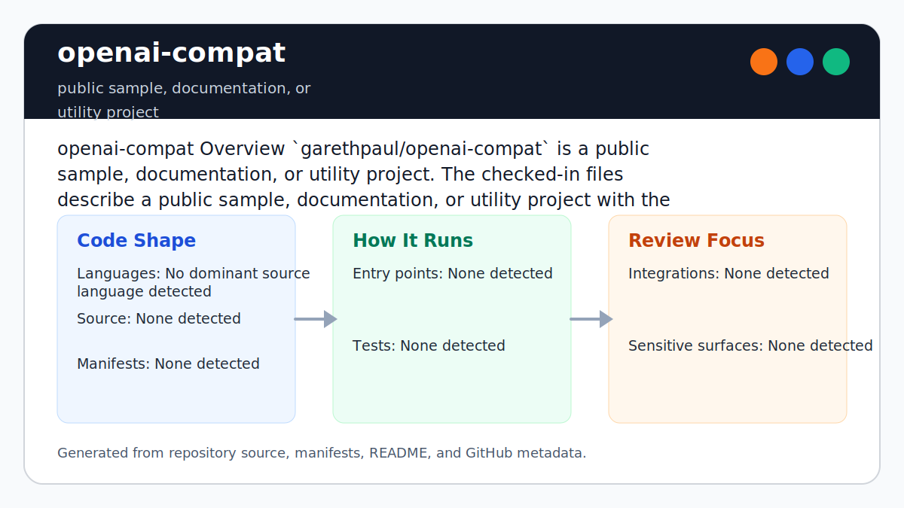

# openai-compat

<!-- README-OVERVIEW-IMAGE -->


## Overview

`garethpaul/openai-compat` is a docs-only placeholder for a possible OpenAI
compatibility project. It does not ship a runtime, proxy, API adapter, or SDK
shim, and it does not currently make any compatibility guarantee.

Do not infer compatibility behavior from the repository name alone. Future
implementation work needs a written compatibility contract, explicit non-goals,
credential-handling rules, logging and payload-retention rules, error
propagation behavior, environment-variable credential policy, rate limits and
retries, versioning rules, documentation evidence, model mapping policy, and
contract tests before any compatibility claim is made.

This README is based on the checked-in source, manifests, scripts, and repository metadata on the `main` branch. The project language mix found during review was: no dominant source language detected.

## Repository Contents

- `.gitignore` - local secrets, logs, dependency, and generated-output ignores
- `CHANGES.md` - baseline change log
- `docs/compatibility-contract.md` - required template before compatibility behavior exists
- `Makefile` - local static verification entry point
- `README.md` - project overview and local usage notes
- `SECURITY.md` - security reporting and disclosure guidance
- `VISION.md` - project direction and maintenance guardrails
- `docs/plans/2026-06-08-openai-compat-baseline.md` - completed sparse baseline plan
- `scripts/check-baseline.py` - static sparse repository baseline checks

Additional scan context:

- Source directories: no top-level source directories detected
- Dependency and build manifests: none detected
- Entry points or build surfaces: none detected
- Test-looking files: no obvious test files detected

## Getting Started

### Prerequisites

- Git
- Python 3

### Setup

```bash
git clone https://github.com/garethpaul/openai-compat.git
cd openai-compat
make lint
make test
make build
make check
```

The setup commands above are derived from repository files. Legacy mobile, Python, or JavaScript samples may require older SDKs or package versions than a modern workstation uses by default.

## Running or Using the Project

- There is no implementation or runtime entry point yet.
- This repository does not ship a runtime or OpenAI-compatible service.
- Do not infer compatibility from the project name or README overview image.
- Treat this repository as a placeholder until the intended compatibility
  contract, language, authentication behavior, and test strategy are documented.
- Use `docs/compatibility-contract.md` as the required checklist before adding
  any proxy, adapter, SDK shim, or endpoint behavior.
- Versioning and compatibility claims must identify the implemented contract
  version before any runtime behavior is advertised.
- Documentation evidence must identify the official documentation source, date
  reviewed, upstream version target, unsupported fields, and matching local
  fixture or contract test before an endpoint is advertised.
- Rate limits and retries must define upstream 429 behavior, retry budgets,
  backoff, and idempotency-key handling before request forwarding exists.
- Model mapping policy must define supported model identifiers, aliases,
  unsupported-model behavior, and silent fallback rules before runtime behavior
  is advertised.
- Environment-variable credential policy must define accepted variables,
  credential source precedence, automatic environment reads, redaction, and
  isolated tests before runtime behavior reads API-key-like values.
- The test fixture policy must define sanitized fixtures, fixture provenance,
  and default tests with no live API calls before behavior is implemented.
- The contract includes non-goals for unsupported API or SDK compatibility,
  upstream forwarding, credential exchange, request retention, streaming, file,
  fine-tuning, batch, webhook, and model-equivalence behavior.
- Python bytecode should not remain after local verification gates; remove
  `__pycache__` or `.pyc` output before considering the workspace complete.

## Testing and Verification

- `make lint`
- `make test`
- `make build`
- `make check`
- `python3 scripts/check-baseline.py`

When the required SDK or runtime is unavailable, use static checks and source review first, then verify on a machine that has the matching platform toolchain.

## Configuration and Secrets

- No required secret or credential file was identified in the repository scan.
  If you add integrations later, keep secrets out of git.
- Future compatibility work must keep API keys and request payloads out of logs,
  fixtures, and generated files unless explicit sanitized fixtures are reviewed.
- Generated Python bytecode is local tooling output and should not be committed
  or left behind after `make check`.

## Security and Privacy Notes

- The scan did not identify production authentication, payment, or secret-management code. Treat future additions in those areas as security-sensitive.
- Any future OpenAI-compatible proxy or SDK shim should define a compatibility
  contract and contract tests before claiming drop-in behavior.
- Non-goals must stay explicit until an endpoint contract and tests replace
  them with implemented behavior.
- Compatibility layers can leak credentials, retain sensitive prompts, or mask
  upstream API errors when request forwarding, logging, and response translation
  are underspecified.
- Versioning must distinguish docs-only placeholders from implemented
  compatibility behavior.
- Documentation evidence must connect future compatibility claims to reviewed
  official documentation and local contract tests.
- Rate limits and retries must be explicit before future proxy behavior can
  hide or transform upstream throttling.
- Model mapping policy must be explicit before future compatibility behavior
  accepts model identifiers or aliases.
- Environment-variable credential policy must be explicit before future
  compatibility behavior reads process environment credentials.
- Test fixture policy must keep sanitized fixtures and no live API calls as the
  default for future contract tests.

## Maintenance Notes

- Run `make lint`, `make test`, `make build`, and `make check` before changing
  the sparse baseline or adding tracked implementation files.
- See `docs/plans/2026-06-09-make-gate-aliases.md` for the local verification
  gate aliases.
- See `SECURITY.md` for vulnerability reporting and safe research guidance.
- See `docs/compatibility-contract.md` for the required compatibility-contract
  template.
- See `docs/plans/2026-06-10-environment-credential-policy.md` for the
  environment-variable credential policy guardrail.
- See `CHANGES.md` and `docs/plans/2026-06-08-openai-compat-baseline.md` for
  the current placeholder baseline.
- See `VISION.md` for project direction and contribution guardrails.

## Contributing

Keep changes small and tied to the project that is already present in this repository. For code changes, document the toolchain used, avoid committing generated dependency directories or local configuration, and update this README when setup or verification steps change.
